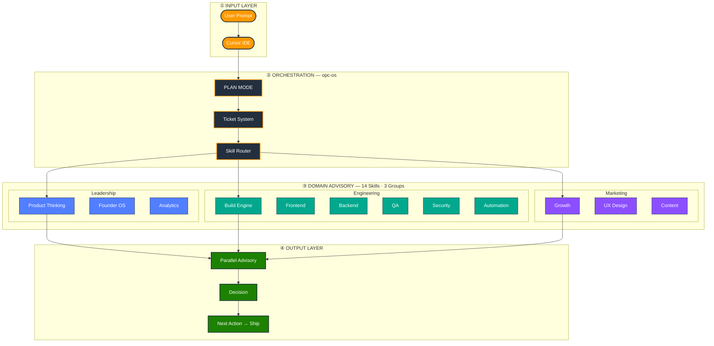

# OPC Skill OS

**Languages:** English | [繁體中文](docs/README.zh-TW.md) | [简体中文](docs/README.zh-CN.md) | [日本語](docs/README.ja.md)

[](https://github.com/louislibuilds/bubblechickenlab-opc-skills/releases)
[](LICENSE)
[](reference/skill.schema.json)
[](https://cursor.com/docs/context/skills)

## Build Products Like a Team of 8 — Even If You're Solo

**OPC Skill OS** turns [Cursor](https://cursor.com) into your AI co-founder team — not another prompt collection.

| Role | Skill |
|------|-------|
| Product Manager | `opc-product-thinking` |
| Frontend Engineer | `opc-build-frontend` |
| Backend Engineer | `opc-build-backend-api` |
| QA Engineer | `opc-build-qa` |
| Security Reviewer | `opc-build-security` |
| Growth Marketer | `opc-growth-engine` |
| Content Strategist | `opc-content-engine` |
| Founder Coach | `opc-founder-os` |

**From idea → MVP → launch.** One prompt becomes a Ticket, routes to the right domains, and ships with a clear next action.

### Why not plain prompts?

| | Prompt library | Cursor Rules | MCP | **OPC Skill OS** |
|---|:---:|:---:|:---:|:---:|
| Reusable prompts | ✅ | ✅ | ❌ | ✅ |
| AI team roles | ❌ | ❌ | ❌ | ✅ |
| Workflow routing | ❌ | ❌ | ✅ | ✅ |
| Ticket + PLAN MODE | ❌ | ❌ | ❌ | ✅ |
| Parallel advisory | ❌ | ❌ | ❌ | ✅ |

## Quick Start

```bash
# Option A — clone and install
git clone https://github.com/louislibuilds/bubblechickenlab-opc-skills.git
cd bubblechickenlab-opc-skills && ./install.sh    # macOS / Linux
# cd bubblechickenlab-opc-skills; .\install.ps1   # Windows

# Option B — one-liner (macOS / Linux)
curl -fsSL https://raw.githubusercontent.com/louislibuilds/bubblechickenlab-opc-skills/main/install.sh | bash
```

```
# Open any project in Cursor, then:
@opc-os Build a job tracker for international students. MVP in 2 weeks.
```

`@opc-os` runs PLAN MODE → creates a Ticket → routes domains → outputs your next action.

## How It Works

Layered architecture — four stages from **prompt** to **shippable next action**:



| Layer | What happens |
|-------|----------------|
| **① Input** | You type a goal in Cursor — one sentence is enough |
| **② Orchestration** | `opc-os` scopes the MVP, opens a Ticket, picks skills |
| **③ Domain Advisory** | Relevant domains review in **parallel** (max 3 bullets each) |
| **④ Output** | One merged decision — what ships now, what's deferred, **next action** |

Full architecture: [docs/architecture.md](docs/architecture.md) · Skill chains: [reference/SKILL-GRAPH.md](reference/SKILL-GRAPH.md)

## Live Demo (text)

**Input:**

```
@opc-os Build a job tracker for international students.
```

**Output (abbreviated):**

```markdown
## Ticket
- id: T-20260713-042
- type: feature
- goal: Job application tracker for international students
- domains_invoked: [opc-product-thinking, opc-build-engine, opc-build-frontend,
  opc-build-backend-api, opc-growth-engine]
- mvp_scope: 2 weeks solo
- blockers: none

## Parallel Advisory
### opc-product-thinking
- [SUGGESTION] MVP: add job + status + deadline only; defer cover letter AI
### opc-build-frontend
- [SUGGESTION] Table view + kanban toggle; mobile-first
### opc-growth-engine
- [SUGGESTION] Landing headline: "Track every application. Miss nothing."

## Decision
- ship_path: Local-first CRUD → export CSV → landing page
- next_action: Scaffold data model (Job: company, role, status, deadline)
```

Full walkthrough: [examples/TICKET-EXAMPLE.md](examples/TICKET-EXAMPLE.md)

> **Video / GIF demo** — coming soon. Star the repo to get notified when we add a screen recording.

## Use Cases

| Audience | What OPC helps you do |
|----------|----------------------|
| **Indie hackers** | Scope MVPs, ship vertical slices, avoid over-engineering |
| **Startup founders** | One prompt → product + growth + content plan |
| **Students** | Turn class projects into shippable portfolios |
| **Agencies** | Repeatable client delivery workflow in Cursor |
| **PMs** | PRD-lite, ticket breakdown, cross-domain review without a team |

## Skill Directory

| Skill | Domain | Role |
|-------|--------|------|
| [opc-os](opc-os/SKILL.md) | meta | Orchestrator, PLAN MODE, Ticket routing |
| [opc-product-thinking](opc-product-thinking/SKILL.md) | 1 | MVP, pricing, validation |
| [opc-build-engine](opc-build-engine/SKILL.md) | 2 | Engineering bus |
| [opc-build-frontend](opc-build-frontend/SKILL.md) | 2 | UI, components, a11y |
| [opc-build-backend-api](opc-build-backend-api/SKILL.md) | 2 | API, DB, auth |
| [opc-build-qa](opc-build-qa/SKILL.md) | 2 | Tests, acceptance |
| [opc-build-security](opc-build-security/SKILL.md) | 2 | OWASP quick gate |
| [opc-growth-engine](opc-growth-engine/SKILL.md) | 3 | SEO, conversion, acquisition |
| [opc-ux-design](opc-ux-design/SKILL.md) | 4 | UX flows, design system |
| [opc-analytics](opc-analytics/SKILL.md) | 5 | Events, funnels, AARRR |
| [opc-automation](opc-automation/SKILL.md) | 6 | Workflows, agents, cron |
| [opc-content-engine](opc-content-engine/SKILL.md) | 7 | Build-in-public, social |
| [opc-founder-os](opc-founder-os/SKILL.md) | 8 | Weekly planning, focus |

## Documentation

| Doc | Description |
|-----|-------------|
| [docs/architecture.md](docs/architecture.md) | System design overview |
| [docs/routing.md](docs/routing.md) | How skills get invoked |
| [docs/create-skill.md](docs/create-skill.md) | Author a new skill |
| [docs/compatibility.md](docs/compatibility.md) | Cursor & OS support |
| [CONTRIBUTING.md](CONTRIBUTING.md) | PR guidelines |
| [reference/typography.md](reference/typography.md) | Latin + CJK font pairing |
| [reference/parallel-review-protocol.md](reference/parallel-review-protocol.md) | Advisory rules |

## Compatibility

| | Supported |
|---|-----------|
| Cursor | v0.40+ (Skills / `@` mentions) |
| macOS | ✅ `install.sh` |
| Linux | ✅ `install.sh` |
| Windows | ✅ `install.ps1` |

Details: [docs/compatibility.md](docs/compatibility.md)

## Design Principles

- **Domains over departments** — engineering/marketing are tags, not org layers
- **Advisory, not blocking** — only `CRITICAL` severity stops ship
- **Solo execution** — default MVP scope ≤ 2 weeks
- **Progressive disclosure** — sub-skills load via `@opc-os` or explicit `@`

## Contributing

We welcome skill contributions, docs improvements, and bug reports. See [CONTRIBUTING.md](CONTRIBUTING.md).

## License

[MIT](LICENSE) — Louis Li / [Bubble Chicken Lab](https://github.com/louislibuilds)

---

Version v1.1.2
