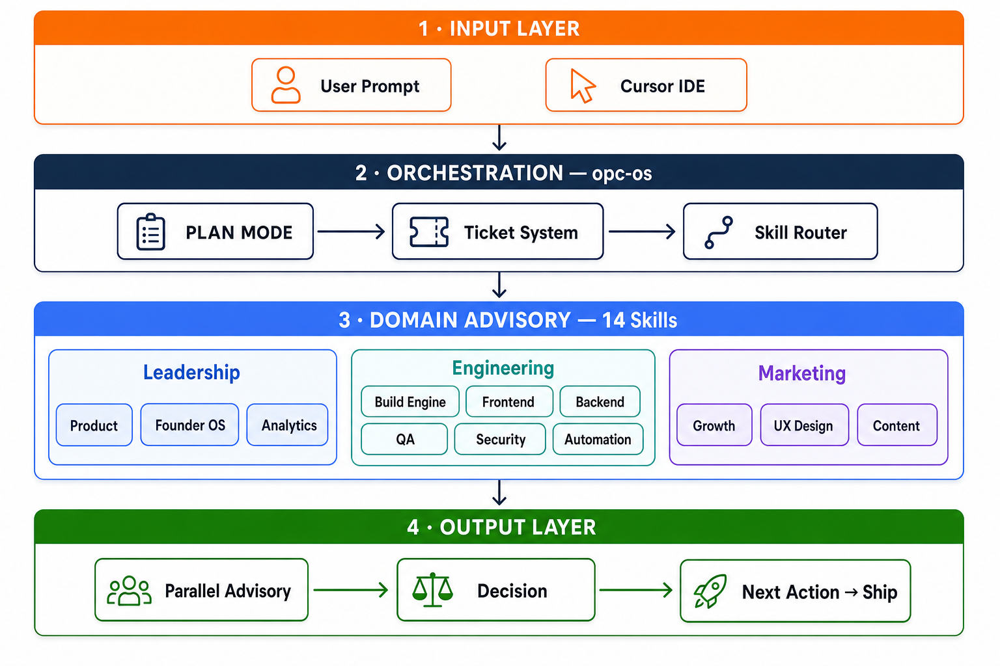

# OPC Skill OS

**言語：** [English](../README.md) | [繁體中文](README.zh-TW.md) | [简体中文](README.zh-CN.md) | 日本語

[](https://github.com/louislibuilds/bubblechickenlab-opc-skills/releases)
[](../LICENSE)
[](../reference/skill.schema.json)
[](https://cursor.com/docs/context/skills)

## 一人で8人チームのように — Solo Founder でも

**OPC Skill OS** は [Cursor](https://cursor.com) を AI 共同創業者チームに変える — 単なるプロンプト集ではありません。

| 役割 | Skill |
|------|-------|
| プロダクトマネージャー | `opc-product-thinking` |
| フロントエンド | `opc-build-frontend` |
| バックエンド | `opc-build-backend-api` |
| QA | `opc-build-qa` |
| セキュリティ | `opc-build-security` |
| グロース | `opc-growth-engine` |
| コンテンツ | `opc-content-engine` |
| ファウンダーコーチ | `opc-founder-os` |

**アイデア → MVP → ローンチ。** 1つのプロンプトが Ticket になり、ドメインにルーティングされ、次のアクションが出力されます。

### 普通のプロンプトとの違い

| | プロンプト集 | Cursor Rules | MCP | **OPC Skill OS** |
|---|:---:|:---:|:---:|:---:|
| 再利用可能 | ✅ | ✅ | ❌ | ✅ |
| AI チーム役割 | ❌ | ❌ | ❌ | ✅ |
| ワークフロー routing | ❌ | ❌ | ✅ | ✅ |
| Ticket + PLAN MODE | ❌ | ❌ | ❌ | ✅ |
| 並列アドバイザリ | ❌ | ❌ | ❌ | ✅ |

## クイックスタート

```bash
git clone https://github.com/louislibuilds/bubblechickenlab-opc-skills.git
cd bubblechickenlab-opc-skills && ./install.sh

# ワンライナー（macOS / Linux）
curl -fsSL https://raw.githubusercontent.com/louislibuilds/bubblechickenlab-opc-skills/main/install.sh | bash
```

```
# Cursor で任意のプロジェクトを開き：
@opc-os Build a job tracker for international students. MVP in 2 weeks.
```

## 仕組み

レイヤーアーキテクチャ — **プロンプト**から**実行可能な次のアクション**まで、4 段階：



| レイヤー | 内容 |
|---------|------|
| **① Input** | Cursor でゴールを入力 — 一文で OK |
| **② Orchestration** | `opc-os` が MVP を定義し Ticket を作成、skills を選択 |
| **③ Domain Advisory** | 関連ドメインが**並列**レビュー（各 3 点まで） |
| **④ Output** | 統合された決定 — 今出すもの、延期、**次のアクション** |

詳細：[docs/architecture.md](architecture.md)

## デモ（テキスト）

**入力：** `@opc-os Build a job tracker for international students.`

**出力（要約）：** Ticket → 並列アドバイザリ → Decision

完全な例：[examples/TICKET-EXAMPLE.md](../examples/TICKET-EXAMPLE.md)

## ユースケース

| 対象 | OPC の役割 |
|------|-----------|
| **Indie hacker** | MVP スコープ、垂直スライス出荷 |
| **起業家** | 1 プロンプト → プロダクト + グロース + コンテンツ |
| **学生** | 課題をポートフォリオに |
| **エージェンシー** | 反復可能な Cursor ワークフロー |
| **PM** | PRD-lite、チームなしの横断レビュー |

## ドキュメント

| ドキュメント | 説明 |
|-------------|------|
| [architecture.md](architecture.md) | アーキテクチャ |
| [routing.md](routing.md) | ルーティング |
| [create-skill.md](create-skill.md) | Skill 作成 |
| [compatibility.md](compatibility.md) | 互換性 |
| [CONTRIBUTING.md](../CONTRIBUTING.md) | 貢献ガイド |

## 互換性

Cursor v0.40+ · macOS / Linux · Windows

[compatibility.md](compatibility.md) を参照

## ライセンス

[MIT](../LICENSE) — Louis Li / Bubble Chicken Lab

---

Translation of README.md at v1.1.3
