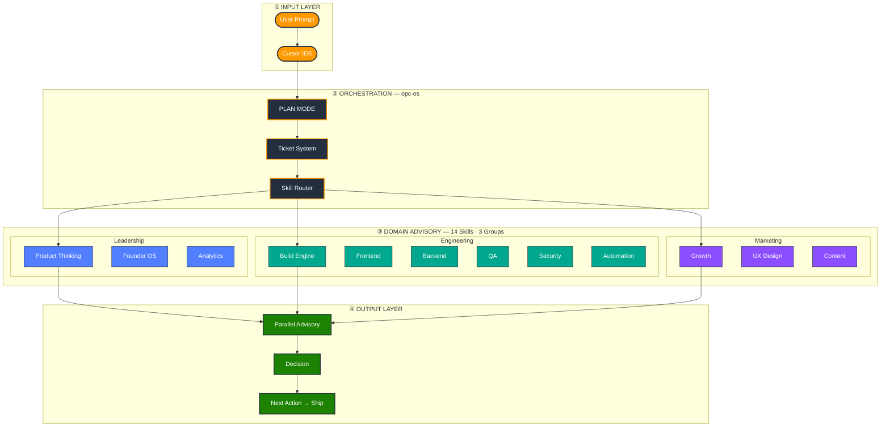

# OPC Skill OS

**语言：** [English](../README.md) | [繁體中文](README.zh-TW.md) | 简体中文 | [日本語](README.ja.md)

[](https://github.com/louislibuilds/bubblechickenlab-opc-skills/releases)
[](../LICENSE)
[](../reference/skill.schema.json)
[](https://cursor.com/docs/context/skills)

## 一人当八人团队用 — 即使你是 Solo Founder

**OPC Skill OS** 把 [Cursor](https://cursor.com) 变成你的 AI 联合创始人团队 — 不是又一个 prompt 合集。

| 角色 | Skill |
|------|-------|
| 产品经理 | `opc-product-thinking` |
| 前端工程师 | `opc-build-frontend` |
| 后端工程师 | `opc-build-backend-api` |
| QA 工程师 | `opc-build-qa` |
| 安全审查 | `opc-build-security` |
| 增长营销 | `opc-growth-engine` |
| 内容策略 | `opc-content-engine` |
| 创始人教练 | `opc-founder-os` |

**从点子 → MVP → 上线。** 一个提示变成 Ticket，路由到对的领域，产出明确的下一步。

### 跟普通 prompt 有什么不同？

| | Prompt 库 | Cursor Rules | MCP | **OPC Skill OS** |
|---|:---:|:---:|:---:|:---:|
| 可重用提示 | ✅ | ✅ | ❌ | ✅ |
| AI 团队角色 | ❌ | ❌ | ❌ | ✅ |
| 工作流路由 | ❌ | ❌ | ✅ | ✅ |
| Ticket + PLAN MODE | ❌ | ❌ | ❌ | ✅ |
| 平行顾问审查 | ❌ | ❌ | ❌ | ✅ |

## 快速开始

```bash
git clone https://github.com/louislibuilds/bubblechickenlab-opc-skills.git
cd bubblechickenlab-opc-skills && ./install.sh

# 或一行安装（macOS / Linux）
curl -fsSL https://raw.githubusercontent.com/louislibuilds/bubblechickenlab-opc-skills/main/install.sh | bash
```

```
# 在 Cursor 打开任一项目：
@opc-os Build a job tracker for international students. MVP in 2 weeks.
```

## 运作方式

分层架构 — 从**提示**到**可执行的下一步**，共四个阶段：



| 层级 | 做什么 |
|------|--------|
| **① Input** | 在 Cursor 输入目标，一句话即可 |
| **② Orchestration** | `opc-os` 定义 MVP、创建 Ticket、选择 skills |
| **③ Domain Advisory** | 相关领域**并行**审查（每域最多 3 点） |
| **④ Output** | 合并决策 — 现在出什么、延后什么、**下一步** |

架构详解：[docs/architecture.md](architecture.md)

## 实际示范（文字版）

**输入：** `@opc-os Build a job tracker for international students.`

**输出（摘要）：** Ticket → 平行顾问 → Decision（next_action: scaffold data model）

完整示例：[examples/TICKET-EXAMPLE.md](../examples/TICKET-EXAMPLE.md)

## 适用对象

| 对象 | OPC 能帮你 |
|------|-----------|
| **Indie hacker** | 收敛 MVP、垂直切片出货 |
| **创业者** | 一个提示 → 产品 + 增长 + 内容计划 |
| **学生** | 把课题做成可展示的作品 |
| **接案方** | 可重复的 Cursor 交付流程 |
| **PM** | PRD-lite、跨领域审查 |

## 文档

| 文档 | 说明 |
|------|------|
| [architecture.md](architecture.md) | 系统架构 |
| [routing.md](routing.md) | Skill 路由 |
| [create-skill.md](create-skill.md) | 新增 Skill |
| [compatibility.md](compatibility.md) | 兼容性 |
| [CONTRIBUTING.md](../CONTRIBUTING.md) | 贡献指南 |

## 兼容性

Cursor v0.40+ · macOS / Linux · Windows

详见 [compatibility.md](compatibility.md)

## 授权

[MIT](../LICENSE) — Louis Li / Bubble Chicken Lab

---

Translation of README.md at v1.1.2
