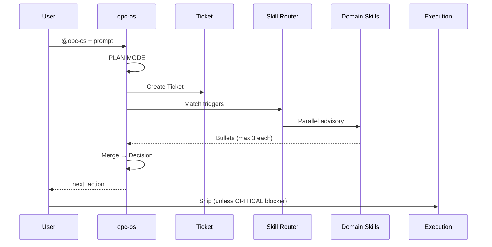

# Architecture

OPC Skill OS is a **Cursor-native AI operating system** for solo founders. It is not a prompt dump — it is a structured workflow layer.

## Layers

```
┌─────────────────────────────────────────┐
│  User (@opc-os + prompt)                │
└─────────────────┬───────────────────────┘
                  ▼
┌─────────────────────────────────────────┐
│  PLAN MODE (mandatory before code)      │
│  goal · product type · skills · MVP     │
└─────────────────┬───────────────────────┘
                  ▼
┌─────────────────────────────────────────┐
│  Ticket System                          │
│  id · type · domains · scope · blockers  │
└─────────────────┬───────────────────────┘
                  ▼
┌─────────────────────────────────────────┐
│  Skill Router (keyword + domain map)    │
└─────────────────┬───────────────────────┘
                  ▼
┌─────────────────────────────────────────┐
│  Parallel Advisory (max 3 bullets each) │
│  CRITICAL · SUGGESTION · NIT            │
└─────────────────┬───────────────────────┘
                  ▼
┌─────────────────────────────────────────┐
│  Decision (opc-os merges)               │
│  ship_path · deferred · next_action      │
└─────────────────────────────────────────┘
```

## Components

| Component | Location | Responsibility |
|-----------|----------|----------------|
| Orchestrator | `opc-os/SKILL.md` | PLAN MODE, Ticket creation, routing, final decision |
| Domain skills | `opc-*/SKILL.md` | Advisory only — no scope expansion |
| Build sub-skills | `opc-build-*/SKILL.md` | Engineering depth; invoked by opc-build-engine |
| Schema registry | `reference/skill.schema.json` | Triggers, dependencies, metadata |
| Skill graph | `reference/SKILL-GRAPH.md` | Trigger chains and shortcuts |
| Protocol | `reference/parallel-review-protocol.md` | Severity rules, anti-patterns |

## Data Flow



## Design Decisions

### Why Tickets?

Every non-trivial prompt becomes a traceable unit of work with domains, scope, and a single next action. Prevents endless re-planning.

### Why parallel advisory?

Sequential role-play ("now I am QA…") is slow and theatrical. Domains comment in parallel; only `CRITICAL` blocks ship.

### Why `disable-model-invocation` on sub-skills?

Progressive disclosure — load depth only when needed. Keeps Cursor context lean.

### Why English skills?

LLM instruction fidelity is highest in English. README translations serve humans; skills serve the agent.

## Install Target

Skills install to `~/.cursor/skills/opc-*` for global `@` access across all projects.

## Extension Points

| Extension | How |
|-----------|-----|
| New domain skill | Add `opc-{name}/SKILL.md` + schema entry |
| Local product preset | `presets/*/PRESET.md` in your workspace (not in repo) |
| Brand tokens | Project `BRAND.md` + `DESIGN-TOKENS.md` |
| Reference guides | `reference/*.md` shared across skills |

## Related

- [routing.md](routing.md) — trigger matching details
- [create-skill.md](create-skill.md) — authoring guide
- [../reference/SKILL-GRAPH.md](../reference/SKILL-GRAPH.md) — visual chains
