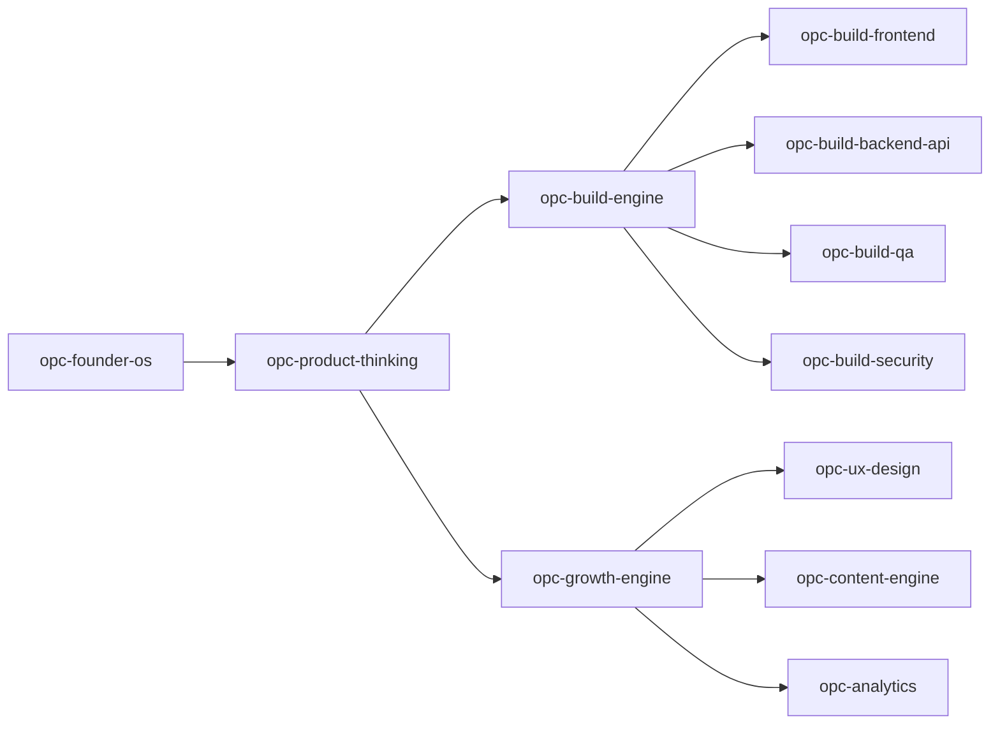

# Routing

How `@opc-os` decides which skills to invoke.

## Router Location

Primary router: `opc-os/SKILL.md` → Domain Router table  
Machine-readable: `reference/skill.schema.json` → `triggers` per skill  
Human chains: `reference/SKILL-GRAPH.md`

## Routing Algorithm (conceptual)

```
1. Parse user prompt + optional @mentions
2. If user @mentions a skill directly → include it
3. Match prompt keywords against schema triggers
4. Apply dependency rules (e.g. build → sub-skills)
5. Cap parallel domains to relevant set (no padding)
6. Emit domains_invoked in Ticket
```

## Trigger Matching

| Signal in prompt | Skills invoked |
|------------------|----------------|
| idea, MVP, pricing, validate | opc-product-thinking |
| build, code, feature, bug | opc-build-engine (+ sub-skills) |
| UI, React, landing, component | opc-build-frontend |
| API, backend, database, auth | opc-build-backend-api |
| test, QA, acceptance | opc-build-qa |
| security, OWASP, secrets | opc-build-security |
| SEO, conversion, growth | opc-growth-engine |
| UX, brand, design system | opc-ux-design |
| analytics, funnel, retention | opc-analytics |
| automate, cron, workflow | opc-automation |
| LinkedIn, post, build-in-public | opc-content-engine |
| weekly, prioritize, focus | opc-founder-os |

## Dependency Rules

From `skill.schema.json`:

- `opc-build-frontend` depends on `opc-build-engine`
- `opc-analytics` depends on `opc-growth-engine`
- `opc-content-engine` depends on `opc-growth-engine`

Do not skip upstream skills when their outputs are missing (e.g. analytics without a defined funnel).

## Shortcut Chains

### New product → ship

```
product-thinking → build-engine → frontend|backend → qa → security → ux → growth → content → analytics
```

### Bug fix

```
build-engine → qa → (security if auth/data)
```

### Marketing only

```
growth-engine + ux-design + content-engine
```

## Explicit Override

Users can force skills:

```
@opc-os @opc-growth-engine @opc-build-frontend Add SEO meta to landing this week.
```

## Anti-Patterns

| Bad | Good |
|-----|------|
| Invoke all 14 skills every time | Match prompt relevance |
| Sequential domain role-play | Parallel advisory bullets |
| Re-open PLAN after advisory | Fix CRITICAL only; defer rest |

## Skill Graph (visual)



Full detail: [../reference/SKILL-GRAPH.md](../reference/SKILL-GRAPH.md)
