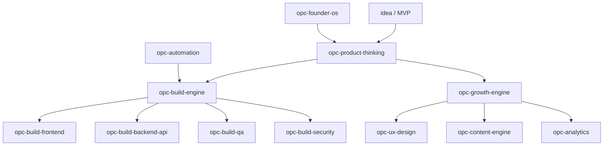

# OPC Skill Graph

Domain trigger chains for the One-Person Company OS. Human-readable companion to `skill.schema.json`.

## Visual Overview



Routing details: [docs/routing.md](../docs/routing.md)

## Primary Chain (new product → ship)

```
idea_validation (opc-product-thinking)
  → mvp_scope (opc-product-thinking)
    → architecture (opc-build-engine)
      → implementation (opc-build-frontend | opc-build-backend-api)
        → verify (opc-build-qa)
          → security_gate (opc-build-security)   # CRITICAL only blocks
            → landing_ux (opc-ux-design)
              → growth_loop (opc-growth-engine)
                → content_distribution (opc-content-engine)
                  → metrics (opc-analytics)
```

## Shortcut Chains

### Bug fix

```
opc-build-engine → opc-build-qa → (opc-build-security if auth/data)
```

### Marketing / brand only

```
opc-growth-engine + opc-ux-design + opc-content-engine
  → cross-ref project BRAND.md / DESIGN-TOKENS.md
```

### Weekly ops

```
opc-founder-os → opc-product-thinking (prioritize) → opc-analytics (if data exists)
```

### Automation

```
opc-automation → opc-build-engine (implementation) → opc-build-qa
```

## Dept Tags (classification only)

| dept_tag | Skills |
|----------|--------|
| `engineering` | opc-build-engine, opc-build-frontend, opc-build-backend-api, opc-build-qa, opc-build-security, opc-automation |
| `marketing` | opc-growth-engine, opc-ux-design, opc-content-engine |
| `leadership` | opc-os, opc-product-thinking, opc-analytics, opc-founder-os |

## Keyword Router (quick reference)

| Keywords | Invoke |
|----------|--------|
| idea, MVP, pricing, validate | opc-product-thinking |
| UI, React, component, landing, CSS | opc-build-frontend |
| API, backend, database, auth, Stripe | opc-build-backend-api |
| test, QA, acceptance, TDD | opc-build-qa |
| security, OWASP, secrets, XSS, SQLi | opc-build-security |
| SEO, conversion, funnel, acquisition | opc-growth-engine |
| UX, onboarding, design system, tokens | opc-ux-design |
| analytics, events, PostHog, A/B | opc-analytics |
| cron, workflow, agent, automate | opc-automation |
| LinkedIn, Twitter, build-in-public, post | opc-content-engine |
| weekly, prioritize, burnout, focus | opc-founder-os |

## Product Presets

Generic defaults above. For project-specific chains, add a local preset under `presets/` in your workspace.

## Dependencies Rule

A skill may assume outputs from its `dependencies` in schema. Do not skip upstream skills when their outputs are missing (e.g. ship API without opc-build-qa when behavior changed).
